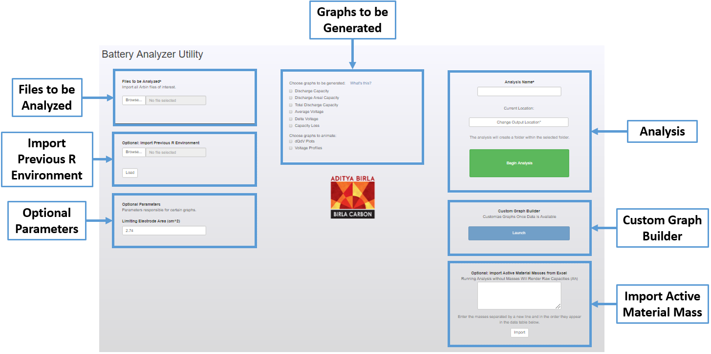
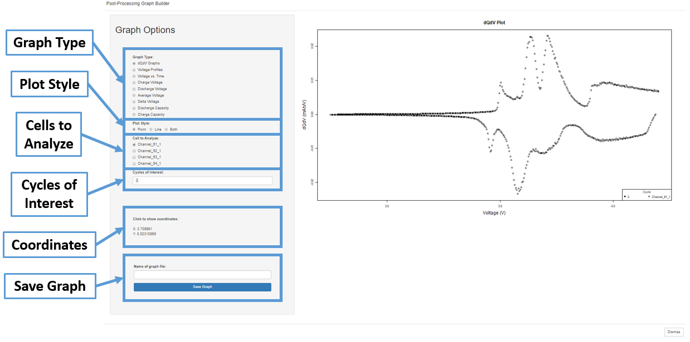

# Let's Get Started!

If you do not have all the required software installed and configured yet, please first visit the [Installation](installation.md) page first.

This page assumes the R project has been opened up and is currently loaded into the RStudio window.

## The Homepage

In order to start the script, begin by pressing the "Run App" button located in the top right corner of the script window. This will take you to the homepage of the application. Here, you will see all the options you have when setting up the analysis. As mentioned on the [Welcome](index.md) page, the only input reauired to begin the analysis is the **data file** that has been exported from Arbin.

### Files to be Analyzed

This is where you put the files that have been exported from the Arbin software. Below is an example of some of the columns that might be present in your file, with the columns marked with a (\*) as mandatory:

<table class="center">
  <tr>
    <th colspan="3">ArbinExportFile.xlsx</th>
  </tr>
  <tr>
    <td><code>Date_Time</code></td>
    <td><code>Test_Time(s)</code>*</td>
    <td><code>Step_Time(s)</code></td>
  </tr>
  <tr>
    <td><code>Step_Index</code>*</td>
    <td><code>Cycle_Index</code>*</td>
    <td><code>Voltage(V)</code>*</td>
  </tr>
  <tr>
    <td><code>Current(A)</code>*</td>
    <td><code>Discharge_Capacity(Ah)</code>*</td>
    <td><code>Charge_Capacity(Ah)</code>*</td>
  </tr>
  <tr>
    <td><code>Charge_Time(s)</code></td>
    <td><code>DisCharge_Time(s)</code></td>
    <td><code>Charge_Energy(Wh)</code></td>
  </tr>
  <tr>
    <td><code>Discharge_Energy</code></td>
    <td><code>Internal Resistance(Ohm)</code></td>
    <td><code>dV/dt(V/s)</code></td>
  </tr>
</table>

### Import Previous R Environment 

This feature was included to accelerate the analysis of past cells. Every time an analysis is run, the final step before completion is to generate a `.RData` file that contains all the setup parameters (everything seen within the datatable on the homepage after import) and select results that can be utilized in the Graph Builder. If you would like to re-run an analysis on a set of batteries, simply import the `.Rdata` file that correlates to the desired test. This can especially be useful if a previous analysis was on an incomplete cycle run or if an error was found. It can also be used to utilize the Graph Builder on a previous analysis, explained in more detail below.

### Optional Parameters

When select graphs are selected, there are additional inputs that are needed for these calculations required (e.g. Discharge Areal Capacity requires the area of the limiting electrode). These additional parameters will become enabled as the graphs requiring them  are selected.

### Graphs to Generate

Each of these graphs are unselected by default. A summary of the graphs generated can be found below:

<table>
  <tr>
    <th>Graph</th>
    <th>X Axis</th>
    <th>Y Axis</th>
    <th>Plot Frequency </th>
  </tr>
  <tr>
    <td>Discharge Capacity</td>
    <td>Cycle</td>
    <td>Discharge Capacity (mAh/g or Ah)</td>
    <td>per cell</td>
  </tr>
  <tr>
    <td>Discharge Areal Capacity</td>
    <td>Cycle</td>
    <td>Discharge Capacity (Ah/cm^2)</td>
    <td>per cell</td>
  </tr>
  <tr>
    <td>Total Discharge Capacity</td>
    <td>Cycle</td>
    <td>Discharge Capacity (mAh/g or Ah)</td>
    <td>per analysis</td>
  </tr>
  <tr>
    <td>Average Voltage</td>
    <td>Cycle</td>
    <td>Voltage (V)</td>
    <td>per cell</td>
  </tr>
  <tr>
    <td>Delta Voltage</td>
    <td>Cycle</td>
    <td>Voltage (V)</td>
    <td>per cell</td>
  </tr>
  <tr>
    <td>Capacity Loss</td>
    <td>Cycle</td>
    <td>Capacity (mAh/g or Ah)</td>
    <td>per cell</td>
  </tr>
</table>

In addition to the static graphs that can be generated, there is also the option to generate select animations. These are graphs typically plotted on a "per cycle" basis, but to avoid the generation of hundreds of animation, they can be summed up in a simple gif. The options available currently are:

<table>
  <tr>
    <th>Graph</th>
    <th>X Axis</th>
    <th>Y Axis</th>
  </tr>
  <tr>
    <td>Differential Capacity (dQdV)</td>
    <td>Voltage (V)</td>
    <td>Differental Capacity (Ah/V)</td>
  </tr>
  <tr>
    <td>Voltage Profile</td>
    <td>Continuous Capacity (mAh/g or Ah)</td>
    <td>Voltage (V)</td>
  </tr>
</table>

### Directory Name and Run Analysis

A directory name is required so that the program knows where to put the data it generates. The program will generate a folder within your current working directory (usually the `arbinimport/` folder that was made when you cloned the repository) with the same name. Hitting "Run Analysis" will cause all inputs to be disabled as the program begins shifting through all the data supplied. A progress bar will appear in the bottom right of the screen, letting you know of the status of the analysis. A typical analysis without graphs will take about 2 minutes for four cells, but the time will increase if graphs or peak fitting are selected.

### Graph Builder

This button launches the Graph Builder. It will be enabled once either an analysis is complete or a previous R environment is imported. See [below](#Graph-Builder) for more information. 

### Import Masses

In order to compare the results of two cells, it is typical to normalize the capacities against an independent variable, such as mass or area. This option allows you to import numerous masses at once from an Excel source. The instructions are outlined once the button is pushed, but to summarize: the masses should be copied from an Excel sheet in a vertical, continuous fashion and the program will extract them directly from your clipboard.

### Data Table

At the very bottom of the screen, you will see a datatable appear once you have imported the data files. It is provided as a validator that all the data has been successfully imported and associated with the proper cell. 

Once you have submitted all the data you wish to be processed, you are ready to hit "Run Analysis"! Once you have begun the analysis, all the input will be disabled and you will see a progress bar appear in the bottom right corner. Upon completion, all the data will become available within the specified directory and you now have the option to start the Graph Builder.

## Graph Builder

The Graph Builder can be enabled in one of two ways: through the completion of an analysis or the import of a previous R environment.

The graph builder is where the rapid diagnostics come to light as it is no longer needed to open up the data in another application and worry about further configuration. WIthin the contents of the graph builder, you are able to bring your data to life without the need of an external plotter. The underlying goal of this utility was to allow the quickest access to your data without worrying about formatting or data filtering, so all the variables are live implemented as soon as they are chosen. In its current implementation, you are able to select from the following variables in realtime:

### Graph Type

Many of these are the ones that could be generated during the analysis, but this allows for comparisons to be made within the same plot

### Plot Style

All plots generated during analysis are point plot, but the Graph Builder gives you the flexability to plot in points, lines, or both

### Cells to Analyze

These are the individual cells associated with the particular analysis

### Cycles of Interest

These are all the cycles associated with the particular cells. The cell with the largest number of cycles determines what is seen. If two cells are selected and one does not possess a cycle the other does, it is simply ignored in plotting.

### Coordinates

Whenever you click within the plot area, the coordinates of the location are displayed here.

### Save Graph 

Once you have configured the graph to your desire, there are two modes of export: copy and paste the graph directly into your final format (best for presentations or word documents) or you can type a name for the file and click "Save Graph". This will save the graph under the given name within your working directory (displayed upon successful completion).
